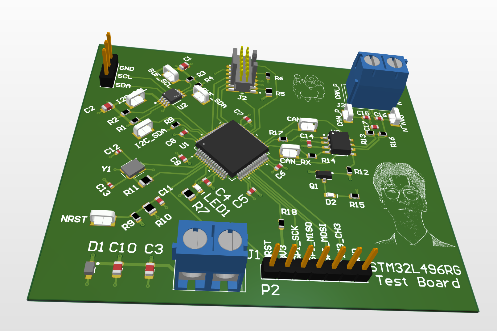
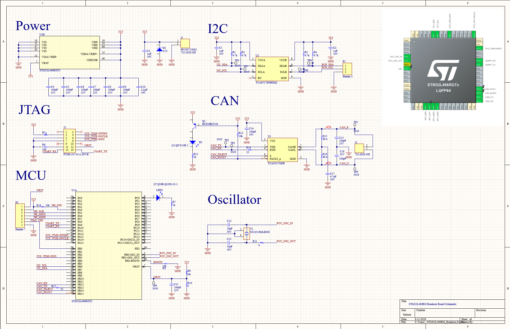
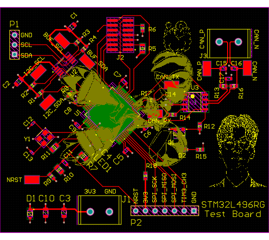
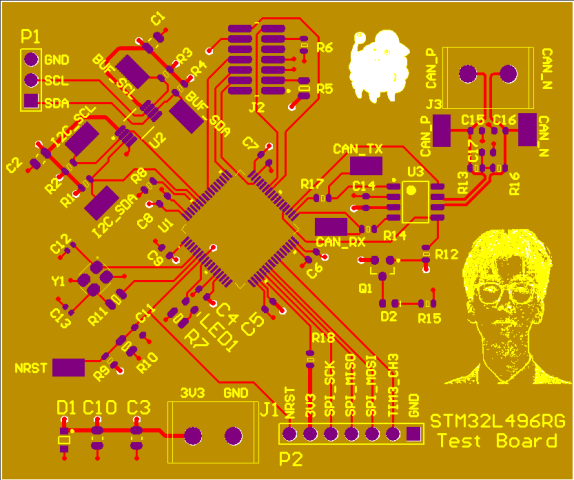
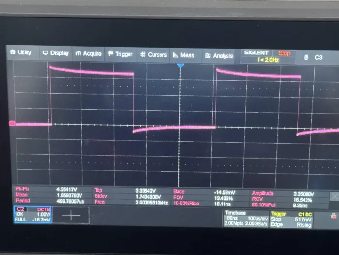
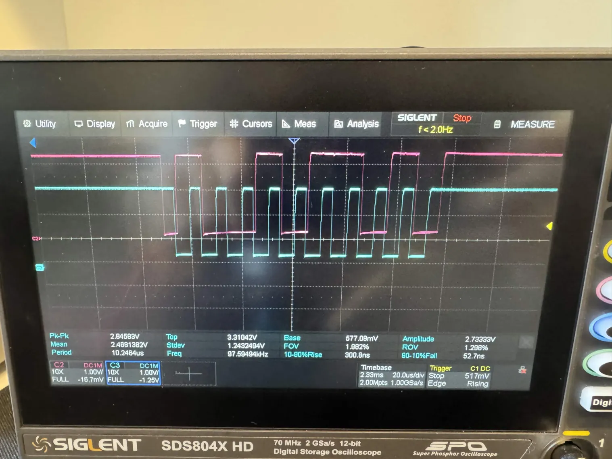
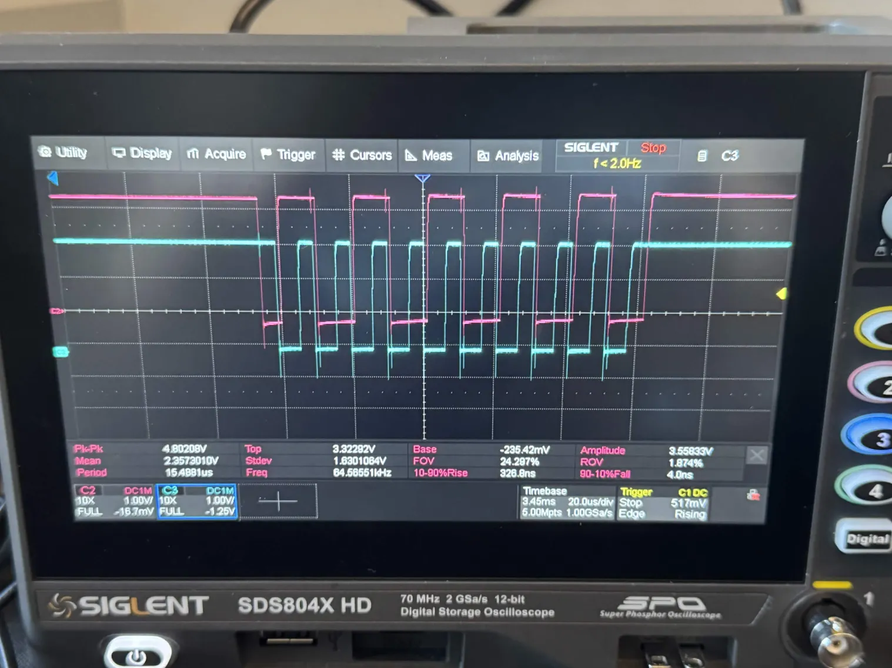
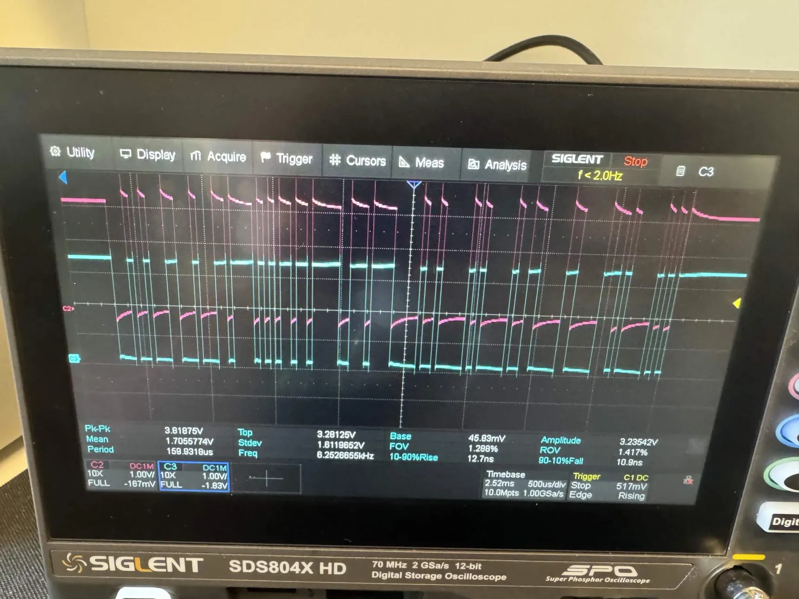

# STM32L496 OBC Test Board
 

 
A breakout board built around the **STM32L496RG** microcontroller. The board breaks out an **I²C** bus (through a level-translating buffer) and a **CAN** bus 
(through a fault-protected transceiver), along with a **timer/PWM** channel, **SPI**, and a debug/serial header. Designed in Altium, fabricated through JLCPCB, 
and brought up on the bench with STM32CubeIDE and an ST-LINK.
  
---
 
## Overview
 
| | |
|---|---|
| **MCU** | STM32L496RGT3 — Arm Cortex-M4, LQFP64 |
| **Key peripherals** | I²C, CAN, timer/PWM, SPI |
| **Debug / programming** | SWD (ST-LINK) + SWO trace; USART1 broken out on the same header |
| **Tools** | Altium Designer · JLCPCB · STM32CubeIDE · ST-LINK |
  
---
 
## Key Images
 
### Schematic
 

 
### PCB Layout
 

---
 
## Bring-Up & Testing
  
### Timer / PWM ✅
 
`TIM3_CH3` configured for PWM generation on **PB0** and broken out to the header. With `PSC = 1`, `ARR = 999` off the 4 MHz timer clock the output lands at **2 kHz at 50 % duty**, confirmed on the scope.
 

 
### I²C ✅
 
The I²C waveform path was verified by issuing a master transmit to an unpopulated address. The capture shows a clean **START → 7-bit address → NACK** on the 9th bit (no slave present to acknowledge).
 

 
### CAN Bus ✅
 
CAN2 was exercised in **loopback** with auto-retransmission, transmitting an 8-byte standard frame (ID `0x123`). On the scope, the pre-transceiver TX/RX test points show idle-high / dominant-low signalling with **RX mirroring TX**, verifying the TCAN337 is actively driving and echoing the bus rather than the MCU just talking to itself.
 

---
 
## Repository Contents
 
- Altium project files (schematic, PCB, project)
- `Images/` — renders, layout, assembled board, and oscilloscope captures
- This README
---
 
*Built and tested by [Laaaarry](https://github.com/Laaaarry).*
